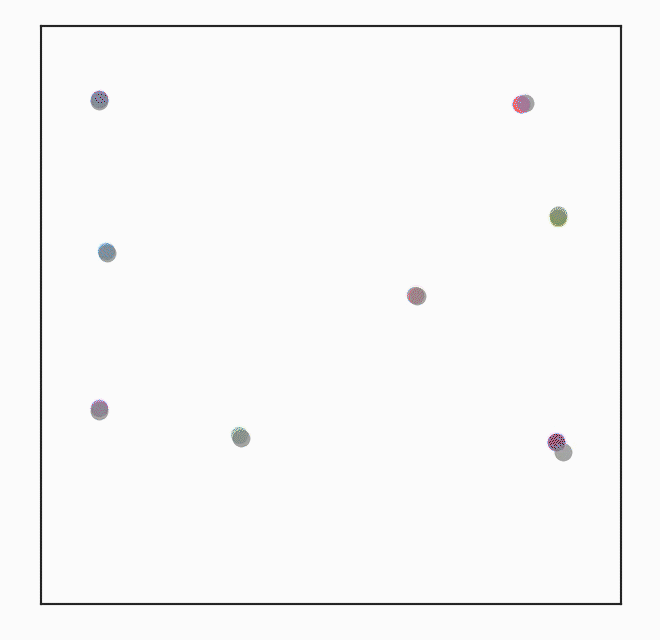
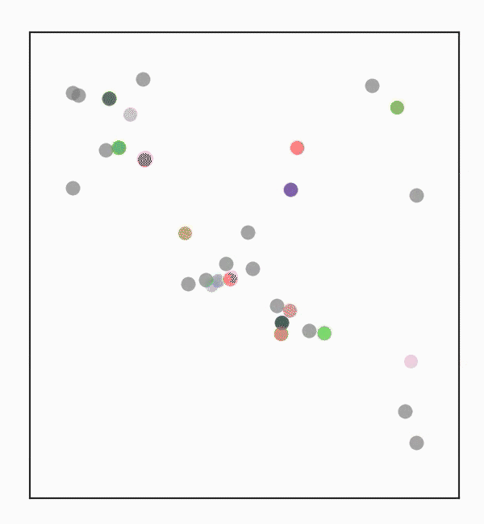

# PIPO: Policy Optimization with Permutation-Invariant Graph Network for Decentralized Multi-Agent Navigation
Code will be available soon.

## Demonstration
The PIPO is developed with [Multi-agent Partical Environments(MPEs)](https://github.com/openai/multiagent-particle-envs)
   

## Dependencies
```
pip install -r requirements.txt
cd envs
pip install -e .
```

## Citation
```
@inproceedings{zhang2022pipo,
  title={PIPO: Policy Optimization with Permutation-Invariant Graph Network for Decentralized Multi-Agent Navigation},
  author={Zhang, Ruiqi and Chen Guang and Hou, Jing and Knoll, Alois},
  booktitle={},
  pages={},
  year={2022},
  organization={IEEE}
}
```
